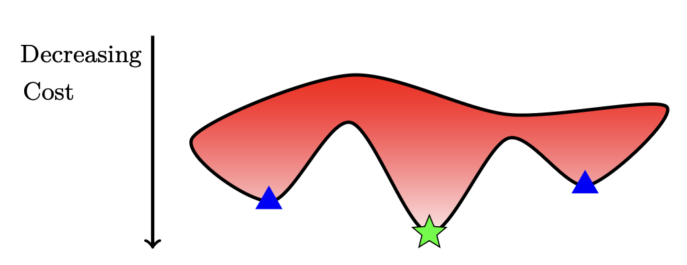
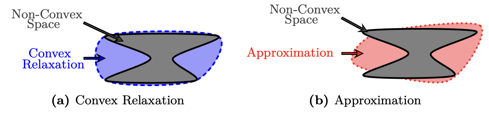

# A Survey of Relaxations and Approximations of the Power Flow Equations

### Capítulos 1-3
Uma análise dos conceitos fundamentais

Daniel K. Molzahn e Ian A. Hiskens

---

## Introdução: O Problema das Equações de Fluxo de Potência

As equações de fluxo de potência são a base para a análise e operação de sistemas elétricos de potência, relacionando as injeções de potência e as tensões no sistema.

**Desafios:**
* **Não linearidade:** As equações são inerentemente não lineares, o que resulta em problemas de otimização não convexos.
* **Complexidade Computacional:** Problemas como o Fluxo de Potência Ótimo (OPF) são geralmente NP-Hard.
* **Múltiplas Soluções:** Podem existir múltiplas soluções locais, tornando difícil encontrar o ótimo global.

*Figura 1: Ilustração de ótimos locais (triângulos azuis) e o ótimo global (estrela verde).*

---

## Relaxações vs. Aproximações

Para lidar com a complexidade, duas abordagens principais são utilizadas:

**Relaxações Convexas:**
* Ampliam o espaço de soluções não convexo para um espaço convexo maior que o contém.
* Garantem limites para o valor ótimo da função objetivo e podem certificar a inviabilidade de um problema.
* Em alguns casos, podem garantir a obtenção de ótimos globais.

**Aproximações:**
* Simplificam as equações de fluxo de potência com base em certas premissas sobre as grandezas do sistema.
* Podem representar o comportamento do sistema com boa precisão sob condições operacionais típicas.
* Não oferecem as garantias teóricas das relaxações.

---

## Visualizando Relaxações e Aproximações

*Figura 2: Ilustração conceitual de uma relaxação convexa (à esquerda) e uma aproximação (à direita) para um espaço não convexo.*

---

## Capítulo 2: Visão Geral das Equações de Fluxo de Potência

As equações de fluxo de potência modelam a relação entre fasores de tensão e injeções de potência nos nós (barras) de um sistema elétrico.

### Notação Básica:
* $V_i = |V_i|e^{j\theta_i}$: Fasor de tensão no barramento $i$ em coordenadas polares.
* $V_i = V_{di} + jV_{qi}$: Fasor de tensão no barramento $i$ em coordenadas retangulares.
* $S_i = P_i + jQ_i$: Injeção de potência complexa no barramento $i$.
* $Y = G + jB$: Matriz de admitância nodal do sistema.

### Formulação I-V:
Esta formulação se baseia na relação linear entre os fasores de tensão e as injeções de corrente, e na definição de potência complexa:

$$I_i = \sum_{k=1}^{n} Y_{ik}V_k $$
$$P_i + jQ_i = V_i \overline{I_i} $$

* As não linearidades estão isoladas nos produtos bilineares da segunda equação.

---

## Formulações Baseadas em Tensão

Substituindo a corrente na equação de potência, obtemos um sistema de equações polinomiais em termos dos fasores de tensão:

$$P_i + jQ_i = V_i \sum_{k=1}^{n} \overline{Y}_{ik} \overline{V}_k $$
$$|V_i|^2 = V_i \overline{V}_i $$

Dependendo da representação (coordenadas polares ou retangulares), obtemos diferentes formulações matemáticas, como as quadráticas (em coordenadas retangulares) ou as trigonométricas (em coordenadas polares).

---

## Equações DistFlow (Fluxo de Ramo)

Propostas por Baran e Wu, são válidas para sistemas radiais e focam nas grandezas que fluem nas linhas. Para uma linha entre as barras $i$ e $k$:

* $P_{ik}, Q_{ik}$: Fluxos de potência ativa e reativa na linha.
* $l_{ik}$: Quadrado da magnitude do fluxo de corrente.
* $|V_i|^2, |V_k|^2$: Quadrado das magnitudes de tensão.

As equações são:
$$P_{ik} = R_{ik}l_{ik} - P_k + \sum_{m:k \to m} P_{km} $$
$$Q_{ik} = X_{ik}l_{ik} - Q_k + \sum_{m:k \to m} Q_{km} $$
$$|V_k|^2 = |V_i|^2 - 2(R_{ik}P_{ik} + X_{ik}Q_{ik}) + (R_{ik}^2 + X_{ik}^2)l_{ik} $$
$$l_{ik}|V_i|^2 = P_{ik}^2 + Q_{ik}^2 $$

A não convexidade está na última equação.

---

## Capítulo 3: Ferramentas de Otimização

Para criar relaxações e aproximações, são utilizadas ferramentas de otimização convexa.

### Programação Linear (LP)
* **Forma canônica:**
    * minimizar $c^T x$
    * sujeito a $Ax = b, x \ge 0$
* **Envelopes de McCormick:** Formam o casco convexo de produtos bilineares $xy$, muito úteis em relaxações.

### Programação Quadrática (QP)
* Permite uma função objetivo quadrática: minimizar $\frac{1}{2}x^T C x + c^T x$.
* É um programa quadrático convexo se a matriz C for positiva semidefinida.

---

## Programação Cônica de Segunda Ordem (SOCP)

Generaliza a LP, permitindo restrições de cone de segunda ordem:
$$||E_i x + b_i||_2 \le g_i^T x + d_i$$

* Restrições quadráticas convexas podem ser representadas como restrições SOCP.
* A QP convexa é um caso especial da SOCP.
* **Restrições SOCP Rotacionadas** são particularmente úteis:
    $$x \cdot y \ge ||z||_2^2, \quad x \ge 0, y \ge 0$$

## Programação Semidefinida (SDP)

Generaliza a SOCP, usando uma matriz simétrica $X$ como variável de decisão.
* **Forma canônica:**
    * minimizar $tr(CX)$
    * sujeito a $tr(A_i X) = b_i, X \ge 0$ (positiva semidefinida)
* A SDP pode ser formulada com variáveis complexas, o que é relevante para as equações de fluxo de potência.

---

## Conclusões dos Capítulos Iniciais

* **Complexidade:** As equações de fluxo de potência são a fonte de não convexidade em muitos problemas de otimização em sistemas de potência.
* **Soluções:** Relaxações e aproximações são estratégias chave para tornar esses problemas tratáveis computacionalmente.
* **Ferramentas:** A otimização convexa (LP, QP, SOCP, SDP) fornece as ferramentas matemáticas fundamentais para construir essas formulações simplificadas.
* **Trade-off:** A escolha entre diferentes formulações (relaxações ou aproximações) e ferramentas de otimização envolve um compromisso entre precisão, garantias teóricas e tratabilidade computacional.